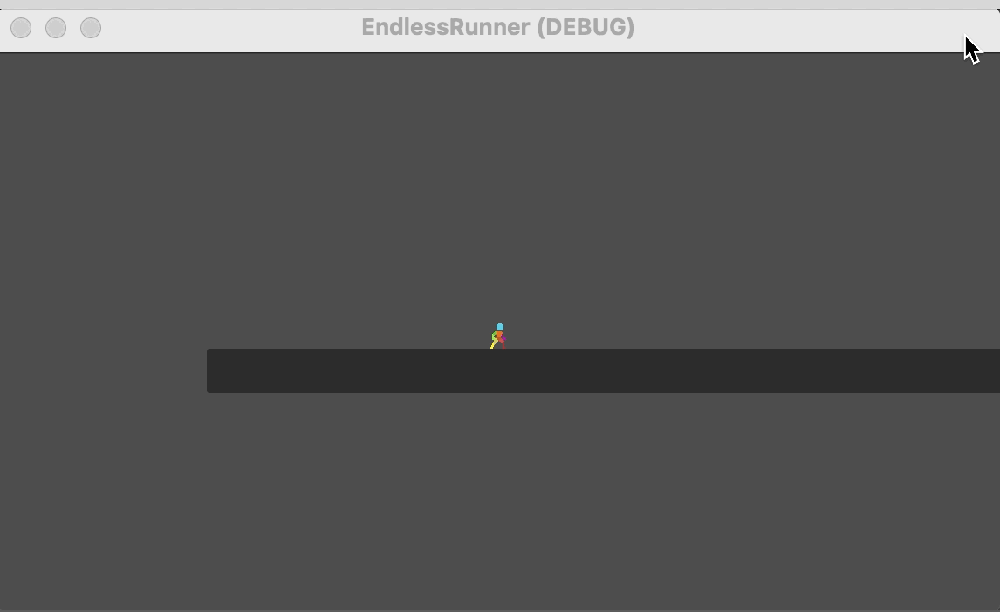

# 2D Endless Runner in Godot 4 (Part 1)



Welcome to the source code repository for a 2D Endless Runner tutorial series crafted in Godot 4. This game project is designed to be a hands-on guide for both beginners and intermediate Godot enthusiasts looking to expand their knowledge.
Dive deeper into the development process by following the [accompanying blog post series](https://learning-godot.com/godot4-endless-runner-p1-player-movement/).

## Table of Contents

- [Features](#features)
- [Getting Started](#getting-started)
- [Prerequisites](#prerequisites)
- [Installation](#installation)
- [Usage](#usage)
- [Contribute](#contribute)
- [License](#license)
- [Acknowledgments](#acknowledgments)

## Features

- Pixel Art graphics for prototyping.
- Player Character with basic movement mechanics: running, jumping, and falling.

## Getting Started

These instructions will guide you on setting up the project locally. For deployment notes, see [below](#deployment).

### Prerequisites

- Godot 4.1 or later. Download [here](https://godotengine.org/download/).

### Installation

1. Clone the repository:

   ```sh
   git clone https://github.com/learning-godot/endless-runner.git
   ```

2. Open the project in Godot 4.
3. Run the Level scene to start the game.

## Usage

Feel free to use this code as a starting point for your own game or as a reference to learn more about Godot 4.
Check the related [blog post series](#) for an in-depth walkthrough.

## Contribute

1. Fork the repository.
2. Create a new branch (`git checkout -b feature/YourFeature`).
3. Commit your changes (`git commit -am 'Add some feature'`).
4. Push to the branch (`git push origin feature/YourFeature`).
5. Open a new Pull Request.

## License

This projects uses the [WTFPL license](http://www.wtfpl.net/)
(Do **W**hat **T**he **F**uck You Want To **P**ublic **L**icense)

## Acknowledgments

- Special thanks to [ZeggyGames](https://zegley.itch.io/2d-platformermetroidvania-asset-pack) for the pixel-art character used in the tutorials.
